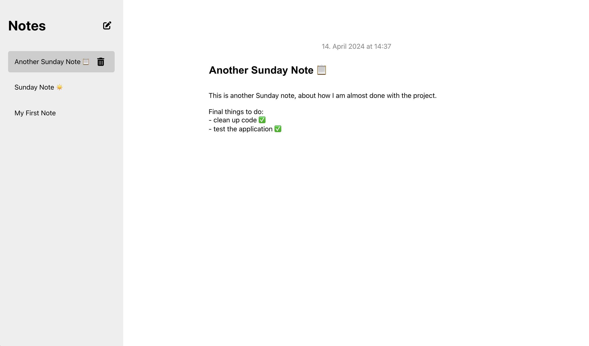

# Notes App

## Overview

This application is a straightforward notes app, with a backend implemented in Python using Django, and a frontend developed in JavaScript using React.

## Features

- **Create, Update, and Delete Notes:** Full CRUD functionality for note management.
- **View All Notes:** Display a list of all notes stored in the database.
- **Detailed Note Viewing:** Access detailed views of individual notes.
- **JSON API Endpoints:** Programmatic interaction with notes through well-defined API endpoints.

## Application Screenshot



## Installation

### Prerequisites

#### Backend

- Python 3.7 or newer
- Conda or Miniconda

#### Frontend

- JavaScript
- npm

### Setup Instructions

#### Clone the Repository

```bash
git clone https://github.com/lukaskaibel/notes-app.git
cd notes-app
```

#### Start the Backend

1. Navigate to the backend directory:

   ```bash
   cd backend/notes_project
   ```

2. Set up a virtual environment (optional, but recommended):

   ```bash
   conda create --name notesenv python=3.7
   conda activate notesenv
   ```

3. Run database migrations:

   ```bash
   python manage.py makemigrations
   python manage.py migrate
   ```

4. Create a superuser for Django admin access:

   ```bash
   python manage.py createsuperuser
   ```

5. Start the development server:
   ```bash
   python manage.py runserver
   ```
   Visit `http://127.0.0.1:8000` in your web browser to access the app.

#### Start the Frontend

1. Navigate to the frontend directory:

   ```bash
   cd ../frontend
   ```

2. Install dependencies:

   ```bash
   npm install
   ```

3. Start the React application:
   ```bash
   npm start
   ```
   The application will be available at `http://localhost:3000`.

## Usage

### API Endpoints

- **GET `/note/get/`**

  - **Description**: Retrieve a single note.
  - **Method**: `GET`
  - **Data Required**: `{"id": <note id>}`
  - **Example**:
    ```bash
    curl http://127.0.0.1:8000/note/get/ -H "Content-Type: application/json" -d '{"id": 1}'
    ```

- **GET `/note/list/`**

  - **Description**: List all notes.
  - **Method**: `GET`
  - **Example**:
    ```bash
    curl http://127.0.0.1:8000/note/list/
    ```

- **POST `/note/new/`**

  - **Description**: Create a new note.
  - **Method**: `POST`
  - **Data Required**: `{"title": "Sample Note", "content": "This is a sample note."}`
  - **Example**:
    ```bash
    curl -X POST http://127.0.0.1:8000/note/new/ -H "Content-Type: application/json" -d '{"title": "New Note", "content": "Content of new note."}'
    ```

- **PUT `/note/edit/`**

  - **Description**: Update an existing note.
  - **Method**: `PUT`
  - **Data Required**: `{"id": <note id>, "title": "Updated Title", "content": "Updated content."}`
  - **Example**:
    ```bash
    curl -X PUT http://127.0.0.1:8000/note/edit/ -H "Content-Type: application/json" -d '{"id": 1, "title": "Updated Title", "content": "Updated content of the note."}'
    ```

- **DELETE `/note/delete/`**
  - **Description**: Delete a note by ID.
  - **Method**: `DELETE`
  - **Data Required**: `{"id": <note id>}`
  - **Example**:
    ```bash
    curl -X DELETE http://127.0.0.1:8000/note/delete/ -H "Content-Type: application/json" -d '{"id": 1}'
    ```

## License

This project is licensed under the MIT License.

## Contact

- **Your Name**: Lukas Kaibel
- **Email**: lukas.kaibel@etu.u-paris.fr
- **Project Link**: [GitHub - Notes App](https://github.com/lukaskaibel/notes-app.git)
